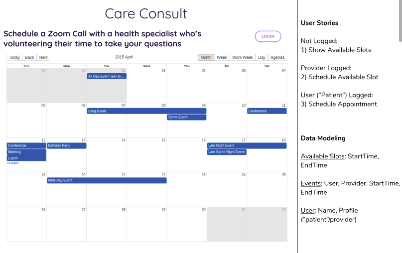

# CareConsult
[Live Site](https://ecstatic-leavitt-3a8f13.netlify.com/)

## Why CareConsult
The Covid-19 pandemic is straining healthcare systems around the globe. CareConsult was created to connect licensed volunteer health professionals with patients at home to reduce the burden on hospitals and clinics.

## Contribute 
- Check the [Kanban Board](https://github.com/users/marcoscannabrava/projects/1)
- Join our [Slack Channel #free-covid-consultations @ COVID19 Global Hackathon](https://join.slack.com/t/globalcovidhackathon/shared_invite/zt-d25lrhkl-UAKmMq4h_zNzCQhqnNsbfw)
- Introduce yourself and let us know what you're working on or if you want to pair with one of us

### Pending Tasks
- [ ] Calendar Component ([suggestion](https://github.com/jquense/react-big-calendar))
- [ ] More branding/marketing assets (text, images)
- [ ] Social Media Assets/Strategy
- [ ] Better design
- [x] SignUp/SignIn screens frontend

#### Pending User Stories
- [ ] Not Logged: Show Available Slots
- [ ] Provider Logged Schedule Available Slot
- [ ] User (“Patient”) Logged: Schedule Appointment

### Wireframe


## Other Features
- Video chat functionality? Maybe it only needs audio for POC. Could use Jitsi 
- Ability for providers to initiate verification process
- Would need to hook into various state medical board DBs in the US
- Ability for platform to take into account license expiration date
- Add other types of certified health professionals? Psychologists etc. 
- Seed list of providers? Can start with NYC medical board website and scrape Dr list? 

### Installation (development)

```bash
git clone git@github.com:marcoscannabrava/free-covid-consultation-calendar.git care-consult
cd care-consult
yarn
yarn develop
```

# Tech Stack
- [React + Gatsby](https://www.gatsbyjs.org/)
- [Firebase](https://firebase.google.com/)
- [Netlify](https://www.netlify.com/)
- kudos to: [gatsby-starter-netlify-cms](https://github.com/netlify-templates/gatsby-starter-netlify-cms)
